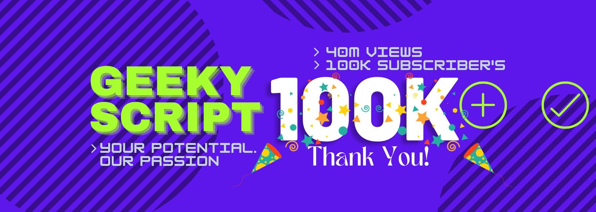

- 👋 Hi, I’m @geekyscript
- 👀 Geeky Script is an e-learning platform with Millions of unique visitors each month. This is an attempt to teach the basics of coding to all aspirants which took me ages to learn. At Geeky Script, we break down computer programming and other tech topics in a way that's friendly for both beginners and tech-savvy folks. If you're into coding or want to know more about the latest technologies then you're in the right spot. 
 
Hit that subscribe button to catch our upcoming videos. I'm here to help with any questions you have about tech. Let's learn and have fun together! 
 
🌐 Stay Connected: 
► Youtube: https://www.youtube.com/c/geekyscript 
► Website: https://geekyscript.com/ 
► Twitter: https://twitter.com/GeekyScript 
► LinkedIn: https://www.linkedin.com/in/geekyscript/ 
 
Exciting tutorials and tech updates are on the way at Geeky Script! 🚀 
 
🎯 Goal: 1M Tech Enthusiasts 
 
Let's dive into the tech world together because learning should be fun and easy!
